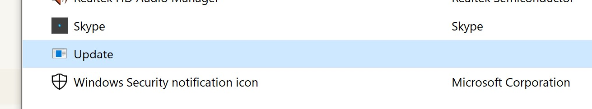

## Issue

Discord app (Stable 138429 (336eed7)) ignores own windows startup setting.

* [How do I disable auto-start on launch](https://support.discord.com/hc/en-us/articles/211339918-How-do-I-disable-auto-start-on-launch-)

Plus, app starts regardless of whether Windows 10 settings don't include it in startup

* [How to stop Windows 10 auto-reopening apps on startup](https://www.wisecleaner.com/how-to/131-how-to-stop-windows-10-from-auto-reopening-applications-after-restart.html)

## Cause

There appears to be some weird link between an app that *is* in the Windows 10 startup list.



This is also found in the Discord directory:

```
/users/<win10-username>/AppData/Local/Discord/update.exe
```

It is also found in Task Manager > Startup, but **not** the startup folder:

```
\Users\<win10-username>\AppData\Roaming\Microsoft\Windows\Start Menu\Programs\Startup
```

**NOTE** The file can't be deleted or moved otherwise Discord won't start.

## Solution

* Open Task Manager > Startup.
* RH-click **Update** > choose **Disable**.
